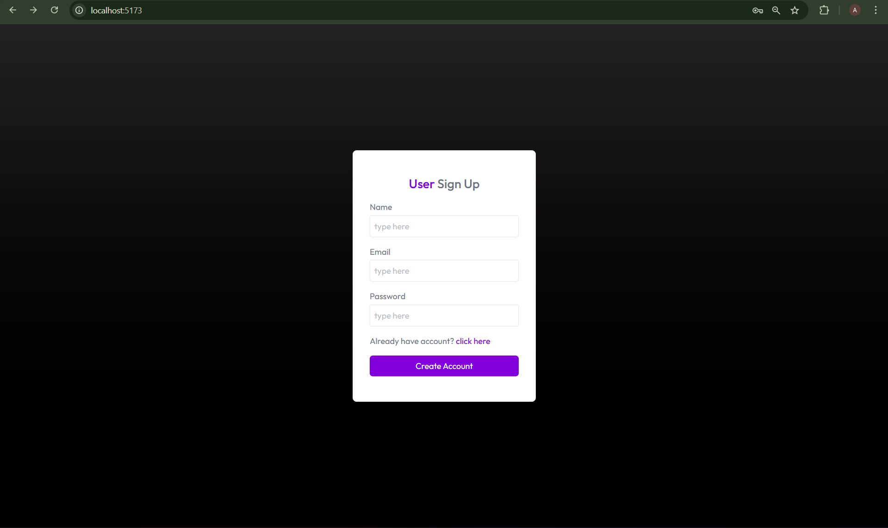
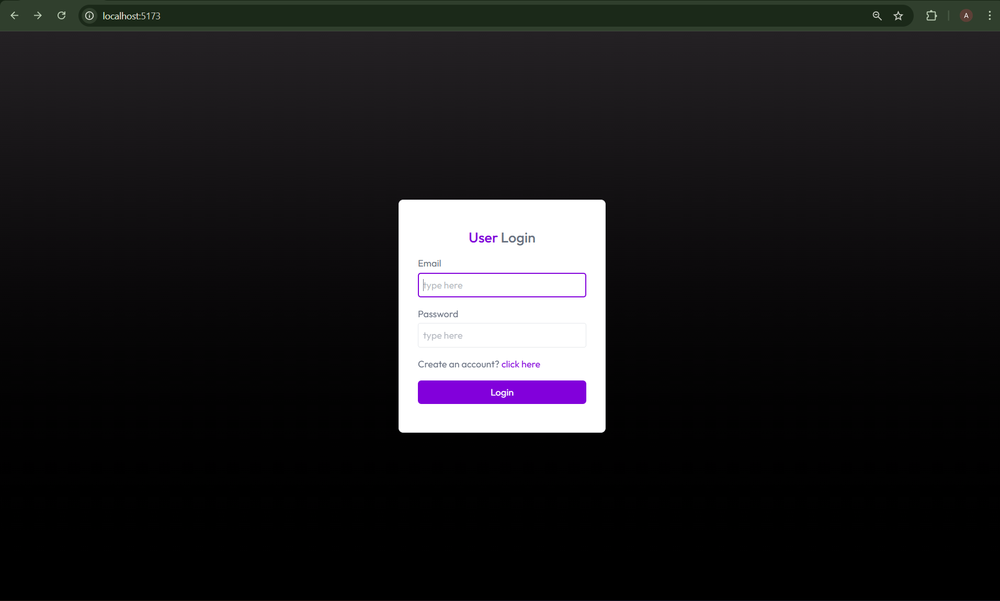
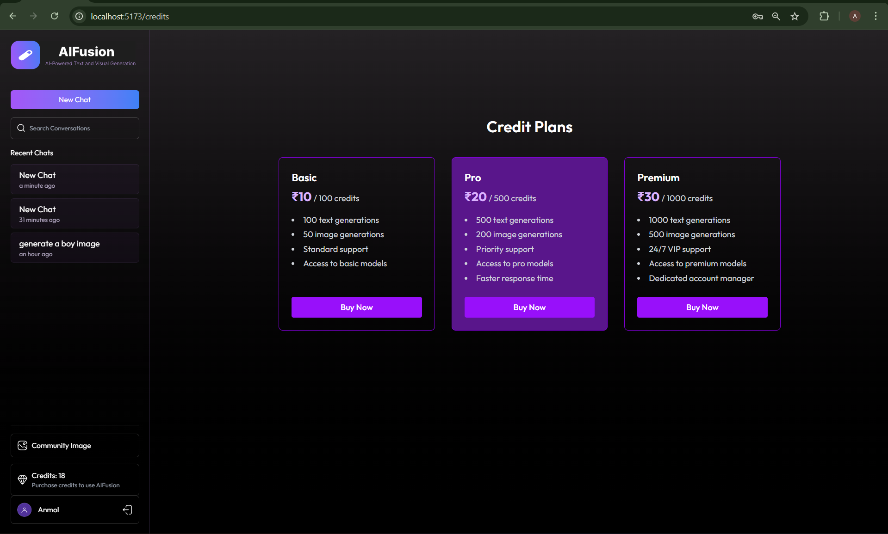
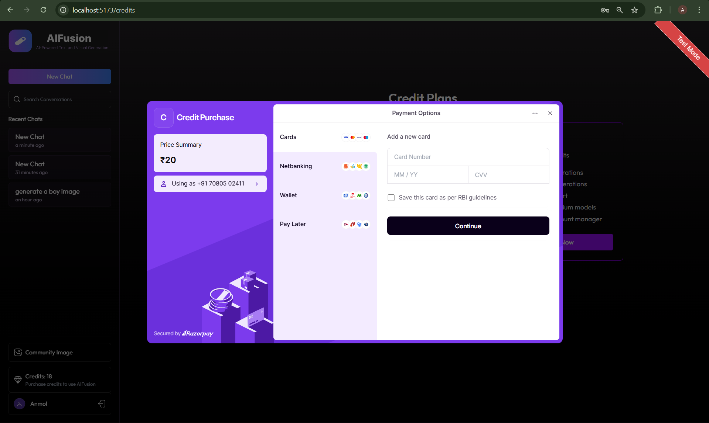
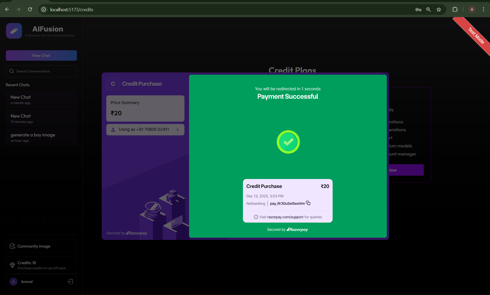

# AIFusion – AI SaaS Web Application

AIFusion is a full‑stack AI SaaS platform that enables users to generate **AI‑powered text and visuals** through a clean, scalable, and monetized web application. The platform integrates modern AI APIs with a secure subscription and credit‑based access model, providing a production‑ready SaaS experience.

---

## 🚀 Project Summary

AIFusion combines advanced AI capabilities with a robust SaaS architecture:

- Engineered core AI features by integrating the **Gemini API** for intelligent text generation and the **Image.io API** for AI‑based image creation.
- Implemented a **credit‑based monetization system**, allowing users to purchase and consume credits based on feature usage.
- Integrated **Razorpay** for secure and reliable payment processing.
- Built a **scalable backend** using Node.js and Express.js to manage authentication, subscriptions, payments, and API usage tracking.
- Developed a complete **MERN stack application** with a responsive React.js frontend and a MongoDB database for persistent storage of users, plans, and generated content.

---

## 🧠 Key Features

- ✨ AI‑powered text generation using Gemini API
- 🖼️ AI image generation via Image.io
- 🔐 Secure user authentication (JWT‑based)
- 💳 Credit‑based SaaS monetization model
- 📦 Subscription and usage management
- 💰 Razorpay payment gateway integration
- 📊 API usage tracking and credit deduction
- 📱 Fully responsive frontend UI

---

## 🛠️ Tech Stack

### Frontend
- React.js
- HTML5, CSS3, JavaScript
- Axios

### Backend
- Node.js
- Express.js
- JWT Authentication

### Database
- MongoDB (Mongoose)

### Payments
- Razorpay

### AI APIs
- Google Gemini API (Text Generation)
- Image.io API (Image Generation)

---

## 🧩 System Architecture

- **Client**: React.js frontend handles UI, authentication, and API requests
- **Server**: Express.js backend manages business logic, payments, credits, and AI requests
- **Database**: MongoDB stores users, credits, subscriptions, and generated content
- **External Services**: Gemini API, Image.io API, Razorpay

---

## 📸 Application Screenshots

Below are the major application flows and UI screens:

### 1️⃣ User Signup


### 2️⃣ User Login


### 3️⃣ Main Dashboard
- AI chat interface
- Text generation
- Image generation


### 4️⃣ Purchase Credits Page


### 5️⃣ Razorpay Payment Flow



---

## ⚙️ Installation & Setup

```bash
# Clone the repository
git clone https://github.com/anmol1kush/AIFusion.git

# Backend setup
cd backend
npm install
npm run dev

# Frontend setup
cd frontend
npm install
npm start
```

---

## 🔐 Environment Variables

Create a `.env` file in the backend directory and configure:

```env
MONGO_URI=your_mongodb_connection
JWT_SECRET=your_jwt_secret
GEMINI_API_KEY=your_gemini_api_key
IMAGE_IO_API_KEY=your_image_api_key
RAZORPAY_KEY_ID=your_razorpay_key
RAZORPAY_KEY_SECRET=your_razorpay_secret
```

---

## 📈 Future Enhancements

- Role‑based access (Admin / User)
- Advanced analytics dashboard
- Team & enterprise plans
- Prompt history and favorites
- Image editing and variations

---

## 👨‍💻 Author

**Anmol Kushwaha**  
Full‑Stack MERN Developer | AI SaaS Enthusiast

---

## 📄 License

This project is licensed under the MIT License.

---

⭐ If you like this project, feel free to star the repository and share your feedback!

